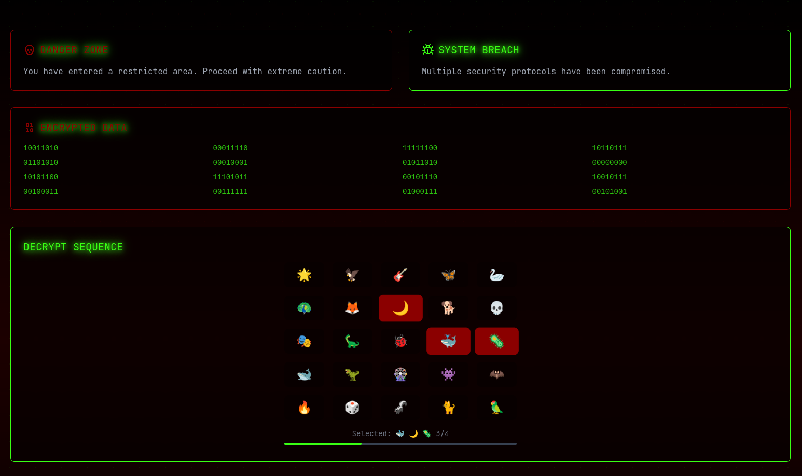

# NoPixel 4head's Market

A cyberpunk-themed web application built with Next.js, featuring a fictional marketplace interface with glitch effects and interactive elements.

## 🚨 Disclaimer

This is a fictional project created for entertainment purposes only. All content, including products and interactions, are part of a game experience. See the [disclaimer page](app/disclaimer/page.tsx) for more details.

## 🛠 Tech Stack

- **Framework**: Next.js 15
- **Styling**: Tailwind CSS
- **UI Components**: Radix UI + shadcn/ui
- **Data Storage**: Airtable/NoccoDB
- **Analytics**: Umami

## 🌟 Features

- Cyberpunk-themed UI with glitch effects and animations
- Interactive product marketplace
- Background music and sound effects
- Responsive design
- Category-based product organization
- Real-time product updates via Airtable

## 🖼️ Screenshots


*Emoji puzzle*

## 🚀 Getting Started

1. Clone the repository
2. Install dependencies:
```bash
pnpm install
```

3. Set up environment variables:
```bash
cp .env.example .env.local && nvim .env.local
```

4. Run the development server:
```bash
pnpm run dev
```

5. Build for production:
```bash
pnpm run build
```
